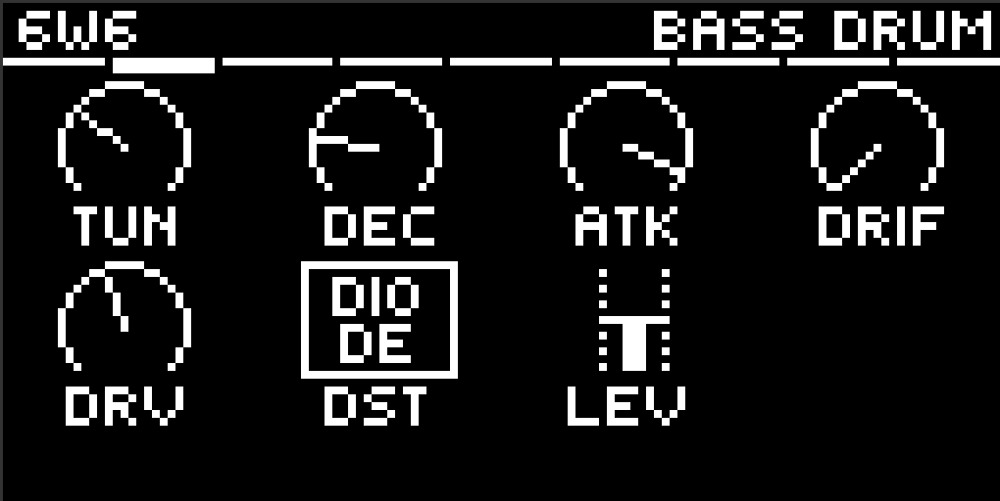
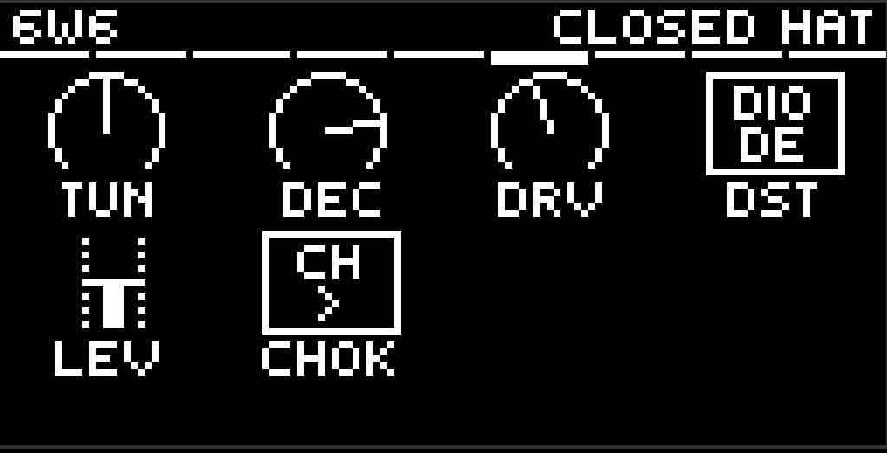
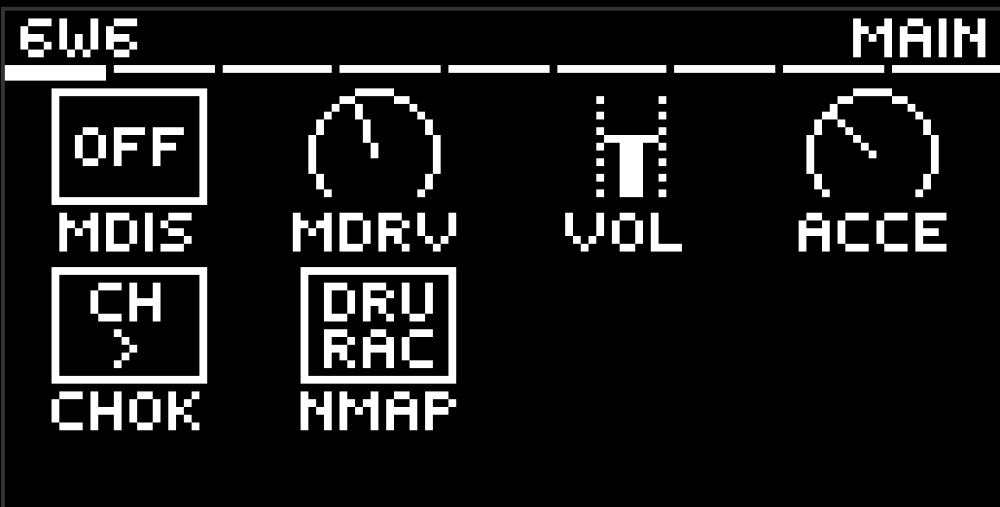
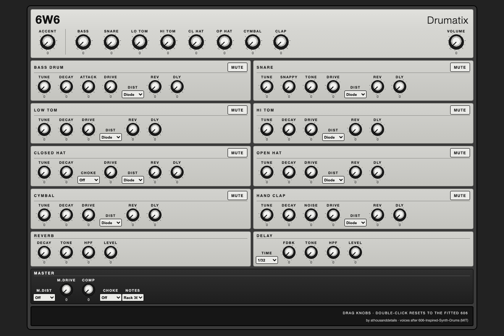

# 6W6 — Drumatix for Ableton Move

A TR-606 style drum machine for [Schwung](https://github.com/charlesvestal/schwung)
on Ableton Move. Every voice is synthesized — no samples — and the kit is
fitted against recordings of a real TR-606, hit for hit. Plus a clap, because
a spare pad is a spare pad.





## Voices

| Voice | Engine |
|---|---|
| Bass Drum | Swept sine body, filtered noise and impulse transients — short and clicky like the 606, not the long 808-style tail. No per-hit drift: a 606 kick does not wander |
| Snare | Tuned shell plus two bandpass-shaped noise "wires". Snappy sets how much wire there is, Tone colours it — turn Snappy up or Tone has nothing to work on. No decay control, because the machine has none |
| Low / Hi Tom | Main mode with quieter resonances around it; the low tom falls into pitch, the high tom leaves a lower ring |
| Closed / Open Hat | One metal bank of 32 measured partials — fitted from a hardware 606's hats — under two envelopes, like the circuit |
| Cymbal | The same metal source with its own 32-line table measured off a hardware cymbal, down to 266 Hz where a hat's table stops at 3.7 kHz |
| Hand Clap | Four timed noise bursts and a diffuse tail |

Every voice has **Tune, Decay, Drive, a Distortion type, Level** and a pair of
**send amounts (Rev, Dly)**. Every continuous control is a **0–127 pot**, and
its default position is the fitted 606.

**Seven distortion types** — Diode, Clip, SAT, BFZ, PDIST, Fold, Crush — per
voice and again on the master bus, where Crush decimates as well as quantises.
**Drive fully down is exactly dry**: the stage is not in the path at all, for
every type.

**Hat choke is a switch**: Off, CH cuts OH (the 606's wiring), or Mutual.

## Send FX

Two buses, fed post-fader from every voice by its **Rev** and **Dly** knobs,
returned before the master distortion so that stage works on the wet signal
too. Both are silent at zero, so the kit is untouched until you send it
something.

| | |
|---|---|
| **Reverb** | Four combs into two allpasses with a 12-bit loop. Decay, Tone, HPF, Level |
| **Delay** | Time is a **note division**, not milliseconds, and follows the host tempo — it stays in time when you change BPM. Feedback darkens each repeat. Time, Fdbk, Tone, HPF, Level |

**Comp** on the Master page is one-knob bus glue — threshold, ratio and
auto-makeup on a single control. Not 606 circuitry, and at zero it is not in
the signal path at all.

## Workflow on the Move

- **Pads (left 4×4)** play and select drums; the parameter page follows what
  you hit. Row 1: BD SD LT HT. Row 2: CH OH CY CP. Pads **9, 10, 11** open
  **Master**, **Reverb** and **Delay** — they switch the page and never sound.
  **Shift+Pad** selects silently (works during playback). **Mute+Pad** mutes
  that drum (`[M]` in the title bar).
- **Move's own gestures win.** Hold **Delete** or **Copy** and every pad passes
  straight through to Move, page pads included, so you can select and clear
  steps on any of them.
- **Knobs 1–8** edit the visible page, drawn with Schwung's stock knob grid
  (host 0.12.1+): **jog** cycles pages, **Shift+Jog** jumps sections, **jog
  click** opens the section list, **Shift** reveals values / fine mode,
  **Mute+knob** resets a pot to its fitted default.
- **Jog click on the Main page locks it** (`[L]` in the title bar). Pads keep
  playing and recording, but the page stops following them, so the master
  knobs stay under your hands while you jam. Shift+Pad still navigates.
- **Sequencing:** use Move's own sequencer — a drum track with a kit, muted
  (HiJack), track MIDI OUT on the slot's channel. Each drum is its own lane.
  Note map: drum rack (36–43, default) or General MIDI, switchable.
- Works with [Movy](https://github.com/DimaDake/schwung-movy) — a
  `movy_config.json` ships with the module.

## Remote panel

A TR-606-style panel in the browser with **every control on screen at once** —
the eight voices, both send buses and the master, plus the 606's own strip of
level knobs across the top. Nothing to click through: the browser's advantage
over the Move's eight-knob screen is space, so it uses it.

It does not follow the device and does not need to — with nothing to switch,
the two can never disagree. The voice you are editing on the Move is simply
**highlighted**. Double-click any knob to reset it to its fitted default.

Open port 7700 on whatever address the Move is on, then `/remote-ui`, while
6W6 is the slot's synth — `move.local:7700` over WiFi, or `172.16.254.1:7700`
over USB-C, which is always that address and works when WiFi does not.



## Install

Requires Schwung **0.12.1 or newer**. Via the Schwung Module Store /
[schwung-manager](https://github.com/charlesvestal/schwung), or manually:
build, then copy `dist/6w6/` to
`/data/UserData/schwung/modules/sound_generators/6w6/` on the device.

## Building

Requires Docker (cross-compiles for the Move's ARM64, pinned to glibc 2.35):

```bash
./scripts/build.sh all            # builds build/dsp.so + dist/6w6-module.tar.gz
./scripts/deploy.sh move.local    # safe deploy (atomic rename, never over a live .so)
```

`scripts/build.sh` also builds `sd606_loadtest`, an on-device test that
dlopens the real `dsp.so` exactly as Schwung's chain host does and checks
that every pad sounds, that pots change the audio, the hat choke, mutes,
state round-trip and the sequencer — end to end.

## Credits and provenance

6W6 stands on other people's work and says so:

- **[606-Inspired-Synth-Drums](https://github.com/analogcode/606-Inspired-Synth-Drums)**
  by Matthew Fecher / AudioKit Pro (MIT) — the voices. Vendored unmodified
  under `src/vendor/606`; every sound 6W6 makes starts there. The cymbal the
  repo does not ship, the hat bank from a second unit, the drive and
  distortion stages, hat choke and accent are 6W6's additions around it.
- **[9W9](https://github.com/athousanddetails/schwung-9W9)** — the module
  architecture, pad gestures and the four distortion flavours, so the two
  kits feel identical under the hands.
- **Schwung** by Charles Vestal and contributors — the platform and the
  shared `param_pages` knob grid; **Movy** by DimaDake for the page model.

Built with AI assistance. GPL-3.0; see `LICENSE` and `THIRD_PARTY.md`.
